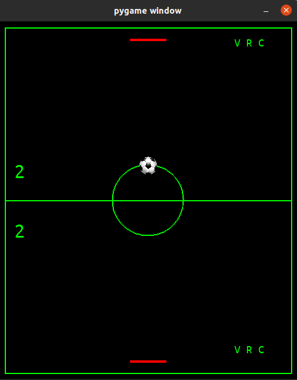

**Ping Pong Game with Pygame**

[portuguese version](README.pt.md)

Small project I made during the end of year vacations of my fourth semester at
my graduation. Simple ping pong game where is possible to play player vs player. 
Game made using Pygame library. 

Controls: keys A, and W to control player 1 (bottom field), keys <-, and -> to control player 2 (top field).

The game also has specials actions, activated by the keys G, H, and J (bottom field), and the numpad keys 1, 2, and 3 
(top field).

- Special 1 (V): next time the ball touches the player's board, it is reflected with double the velocity.
- Special 2 (R): player's field limit will reflect the ball one time.
- Special 3 (C): next time the ball touches the player's board, two balls are reflected.

Obs.:  all specials are deactivated once one of the players make a point.
